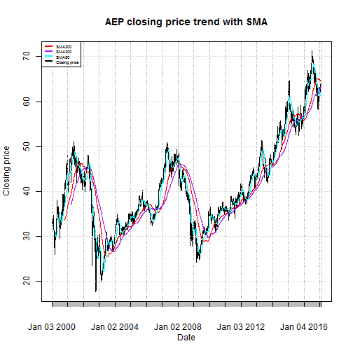
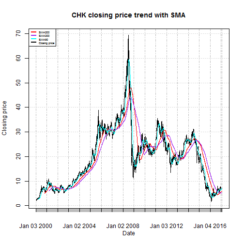
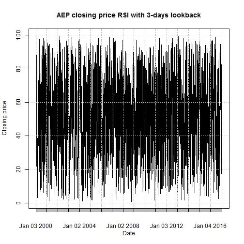
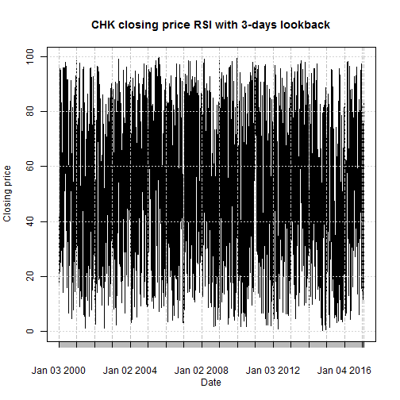
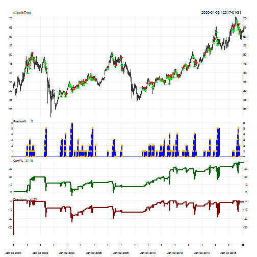
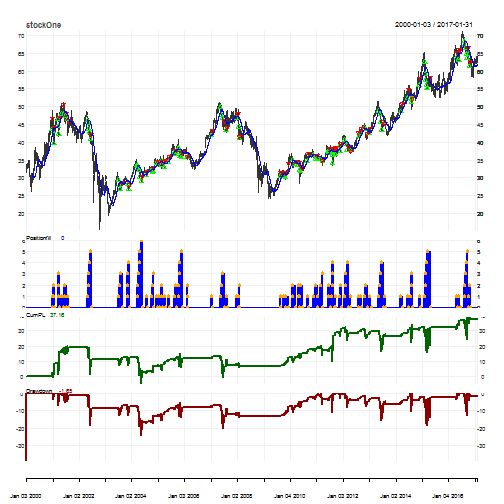
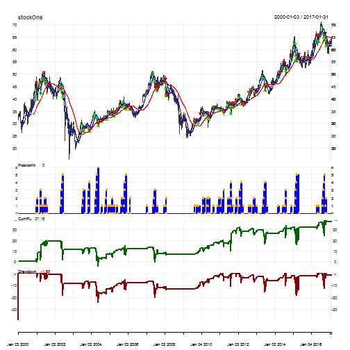
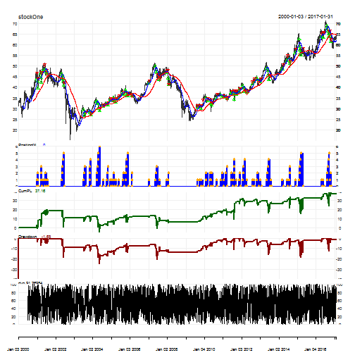
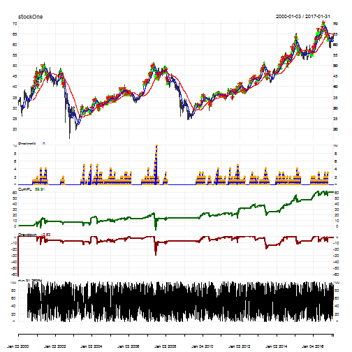
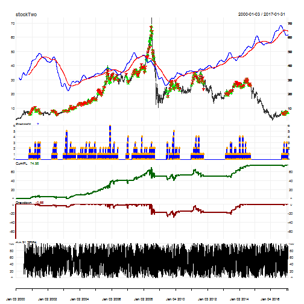

--- Slide Separator

## INTRODUCTION  
  
  This project aims at building a model that will ideally always output successful bids in the stock market. For that, it builds a model which gives better results when constantly trained in a sliding-time window.
The goal is to design a simple financial trading strategy that will be profitable and that will provide a good risk-adjusted measure of return.  

--- Slide Separator

## DATA SETS  
  
  Two datasets will be used here to test the strategy:

- The American Electric Company (AEP) dataset from Quandl

|  Open|  High|   Low| Close| Volume| Ex-Dividend|
|-----:|-----:|-----:|-----:|------:|-----------:|
| 32.00| 32.00| 31.12| 31.44| 396900|           0|
| 31.38| 31.94| 31.38| 31.81| 325500|           0|
| 31.94| 33.13| 31.88| 33.00| 392200|           0|
| 32.75| 33.69| 32.75| 33.19| 433000|           0|
| 33.38| 33.75| 33.06| 33.63| 250500|           0|
| 33.63| 33.81| 33.44| 33.50| 307700|           0|

--- Slide Separator 

## DATA SETS  

- The Chesapeake Energy Corporation (CHK) from Quandl.

| Open| High|  Low| Close| Volume| Ex-Dividend|
|----:|----:|----:|-----:|------:|-----------:|
| 2.31| 2.38| 2.25|  2.25| 369700|           0|
| 2.19| 2.25| 2.06|  2.06| 719400|           0|
| 2.12| 2.19| 1.94|  2.06| 807100|           0|
| 1.94| 2.12| 1.94|  2.12| 444900|           0|
| 2.06| 2.12| 2.06|  2.06| 207400|           0|
| 2.06| 2.12| 2.06|  2.12| 166700|           0|

--- Slide Separator 

##  DATA SETS
  
  An initial exploration of the AEP dataset reveals 5 important fields:  

- The date
- The Open price
- The High price
- The Low price
- The Close price.  
  
  Some of the issues encountered with the data:  

- The presence of the adjusted closing price was confusing for some methods in the packages Quandstrat and xts, as those methods kept throwing errors. I had to remove the adjusted closing price from my data sets and just keep the closing price
- Some functions and arguments were not found because the Quandstrat package is not yet stable.

--- Slide Separator 

## PRELIMINARY EXPLORATION  

  
  Indicators are transformations of market data that give an insight into the overall market behavior by measuring current conditions and/or forecasting trends.  Among others, there are trend-following indicators which depict the general price direction, and oscillators used to discover on a scale of 0 to 100 short-term overbought (above 70 to 80) or oversold (below 30 to 20) conditions .
  Combining trend-following indicators and oscillator/reversion indicators gives more insight into the data for this project. The preliminary oscillator used is an RSI (Relative Strength Index) with a 3-days lookback period. The preliminary trend indicators are 3 SMA (Simple Moving Average). After applying those indicators to the stocks, there are some periods of time during which none of the indicators seem to be right.  

--- Slide Separator 

## PRELIMINARY EXPLORATION

### TREND-FOLLOWING INDICATORS: SIMPLE MOVING AVERAGES  
  
  The SMA50 (Simple Moving Average) seems to better mimic the trend of the closing prices for both data sets

--- Slide Separator 

## PRELIMINARY EXPLORATION

- SMA AEP

--- Slide Separator 

## PRELIMINARY EXPLORATION

- SMA CHK

--- Slide Separator 

## PRELIMINARY EXPLORATION

### OSCILLATOR/REVERSION INDICATOR: RSI
    
  An observation of the graphs of the stocks’ RSI reveals that there are effectively periods of reversion (2013-09-03 to 2013-9-05 for example) that won’t be captured by a trend-following indicator:

--- Slide Separator 

## PRELIMINARY EXPLORATION

- RSI AEP

--- Slide Separator 

## PRELIMINARY EXPLORATION

- RSI CHK

--- Slide Separator 

## APPROACH
  

  The main objective is to obtain a profit factor above 1 after running the strategy on each of the data sets. 
The approach here would be to combine both SMA50 and SMA200 with an oscillator to avoid false signals. The trend-following indicators would help catch up trends. 
	The analysis is done on 13 years, from January 01s, 2013 to December 31st, 2016 . The time is Eastern time and the currency is US dollar.

  

--- Slide Separator 

### STRATEGY 1: RSI  

  "RSI Strategy", the initial strategy for this project, uses simple averages (over 50 days and over 200 days) with a custom RSI_3_4 indicator acting as an average between RSI3 and RSI4 . 
  Signals help interpret how indicators interact with the market and with each other. Those signals are:  

- a comparison and a crossover , which show a buy signal when the 50-day simple moving average is above the 200-day simple moving average and show a sell signal when the 50-day simple moving average crosses below the 200-day simple moving average
- a threshold, which an oversold condition, thus a buy opportunity, for RSI_3_4 below 20, and an overbought condition, thus a sell opportunity, for RSI_3_4 above 80
- a combined comparison and threshold to buy when the 50-day simple moving average is above the 200-day simple moving average and RSI_3_4 is less then 20.  

--- Slide Separator 

### STRATEGY 1: RSI  
  
  Rules help shape trading transactions at signal execution. They generate orders using market data, indicators and signals. This strategy has 2 rules:  

- an entry rule of 1 share for the combined comparison and threshold entry signals
- an exit rule for a treshold above 80.

--- Slide Separator 

### STRATEGY 1: RSI  
  
  Running this RSI_3_4 strategy on the AES and the CHK over those 13 years, yields profit factors above 1, meaning that the strategy is profitable:

|         |Symbol   | Profit.Factor|
|:--------|:--------|-------------:|
|stockOne |stockOne |      1.952576|
|stockTwo |stockTwo |      1.463076|

--- Slide Separator 

### STRATEGY 1: RSI  
  
  Let's take a look at the system performance for the 2 stocks:

- Stock 1: AES  

--- Slide Separator 

### STRATEGY 1: RSI  
  
- stock 2: CHK

--- Slide Separator 

### STRATEGY 1: RSI  
  
  We can further analyze this RSI-3_4 strategy by getting the order book and retrieving the trade statistics:  

--- Slide Separator 

### STRATEGY 1: RSI  
  

|                   |stockOne     |stockTwo     |
|:------------------|:------------|:------------|
|Portfolio          |RSI strategy |RSI strategy |
|Symbol             |stockOne     |stockTwo     |
|Num.Txns           |169          |177          |
|Num.Trades         |55           |58           |
|Net.Trading.PL     |37.16        |23.56        |
|Avg.Trade.PL       |0.6756364    |0.4194828    |
|Med.Trade.PL       |1.05         |1.13         |
|Largest.Winner     |7.92         |5.86         |
|Largest.Loser      |-9.42        |-19.36       |
|Gross.Profits      |76.17        |76.87        |
|Gross.Losses       |-39.01       |-52.54       |
|Std.Dev.Trade.PL   |2.915206     |3.585156     |
|Percent.Positive   |70.90909     |75.86207     |
|Percent.Negative   |29.09091     |24.13793     |
|Profit.Factor      |1.952576     |1.463076     |
|Avg.Win.Trade      |1.953077     |1.747045     |
|Med.Win.Trade      |1.500        |1.485        |
|Avg.Losing.Trade   |-2.438125    |-3.752857    |
|Med.Losing.Trade   |-1.15        |-1.97        |
|Avg.Daily.PL       |0.6756364    |0.4194828    |
|Med.Daily.PL       |1.05         |1.13         |
|Std.Dev.Daily.PL   |2.915206     |3.585156     |
|Ann.Sharpe         |3.679120     |1.857404     |
|Max.Drawdown       |-24.44       |-39.85       |
|Profit.To.Max.Draw |1.5204583    |0.5912171    |
|Avg.WinLoss.Ratio  |0.8010569    |0.4655241    |
|Med.WinLoss.Ratio  |1.3043478    |0.7538071    |
|Max.Equity         |38.81        |33.28        |
|Min.Equity         |-4.56        |-6.57        |
|End.Equity         |37.16        |23.56        |

|                                | stockOne.DailyEndEq| stockTwo.DailyEndEq|
|:-------------------------------|-------------------:|-------------------:|
|Annualized Sharpe Ratio (Rf=0%) |           0.1945513|           0.1296419|

--- Slide Separator 

### STRATEGY 1: RSI   
  
  For both instruments, the profit factor (absolute value ratio of gross profits over gross losses ) is above 1 . Therefore, this strategy is profitable.

Profit factor = Abs( gross profits / gross losses)  
  
  The sharpe ratio is a risk-adjusted measure of return.

Sharpe ratio = (Mean portfolio return - Risk-free rate ) / Standard deviation of portfolio return

  
  The annualized sharpe ratios are low, the highest being ~ 0.23 on stock AEP. Let's try to increase the annualized sharpe ratio by changing the oscillator of this strategy. 

--- Slide Separator 

## APPROACH

### STRATEGY 2: DVO
  
  Instead of using the RSI_3_4 as the oscillator, let's use a custom DVO with navg = 2 and a percentlookback period of 126 that we call DVO_2_126 . The trend following indicators SMA50 and SMA200 stay the same
 , as well as the signals, rules and settings of the strategy.  

  

--- Slide Separator 

### STRATEGY 2: DVO

  Let's run the DVO strategy.

  Performance of the systems:  
  
- stock 1: AEP

  

--- Slide Separator 

### STRATEGY 2: DVO

  
- stock 2: CHK

--- Slide Separator 

### STRATEGY 2: DVO
  
  Analyzing this DVO strategy, we get the following trade metrics:  

--- Slide Separator 

### STRATEGY 2: DVO

|                   |stockOne     |stockTwo     |
|:------------------|:------------|:------------|
|Portfolio          |DVO strategy |DVO strategy |
|Symbol             |stockOne     |stockTwo     |
|Num.Txns           |501          |473          |
|Num.Trades         |185          |184          |
|Net.Trading.PL     |59.91        |74.98        |
|Avg.Trade.PL       |0.3238378    |0.4085326    |
|Med.Trade.PL       |0.52         |0.47         |
|Largest.Winner     |9.06         |9.33         |
|Largest.Loser      |-11.12       |-16.16       |
|Gross.Profits      |173.49       |176.69       |
|Gross.Losses       |-113.58      |-101.52      |
|Std.Dev.Trade.PL   |2.352974     |2.522341     |
|Percent.Positive   |70.81081     |72.28261     |
|Percent.Negative   |29.18919     |26.63043     |
|Profit.Factor      |1.527470     |1.740445     |
|Avg.Win.Trade      |1.324351     |1.328496     |
|Med.Win.Trade      |0.98         |0.91         |
|Avg.Losing.Trade   |-2.103333    |-2.071837    |
|Med.Losing.Trade   |-1.21        |-0.92        |
|Avg.Daily.PL       |0.3238378    |0.4085326    |
|Med.Daily.PL       |0.52         |0.47         |
|Std.Dev.Daily.PL   |2.352974     |2.522341     |
|Ann.Sharpe         |2.184795     |2.571125     |
|Max.Drawdown       |-30.13       |-29.43       |
|Profit.To.Max.Draw |1.988384     |2.547740     |
|Avg.WinLoss.Ratio  |0.6296440    |0.6412167    |
|Med.WinLoss.Ratio  |0.8099174    |0.9891304    |
|Max.Equity         |62.54        |75.64        |
|Min.Equity         |-7.24        |-0.75        |
|End.Equity         |59.91        |74.98        |

--- Slide Separator 

### STRATEGY 2: DVO

|                                | stockOne.DailyEndEq| stockTwo.DailyEndEq|
|:-------------------------------|-------------------:|-------------------:|
|Annualized Sharpe Ratio (Rf=0%) |           0.3210269|           0.4282121|
  

--- Slide Separator 

## CONCLUSION  
  
  On the same period of time, the same instruments/stocks and the strategy settings, the RSI strategy has a higher profit factor compared to the DVO strategy for each of the stocks respectively. 
  However, there are more transactions in the DVO strategy and its annualized sharpe ratios are much better than the ones of the RSI strategy. 
  Therefore, the absolute value of the gross profits over gross losses is higher in the RSI strategy for each respective stok, while the return per unit of risk is better in the DVO strategy.  
  
  Nonetheless, is that enough to select one strategy over the other? Would an entry rule with an order sizing functon instead of a single share considerably improve one strategy over 
  the other in terms of profit and risk-adjusted return?

